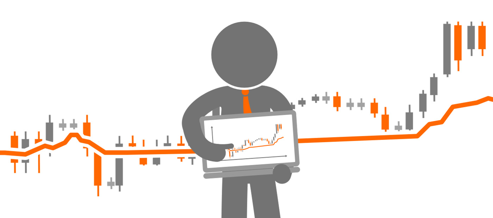
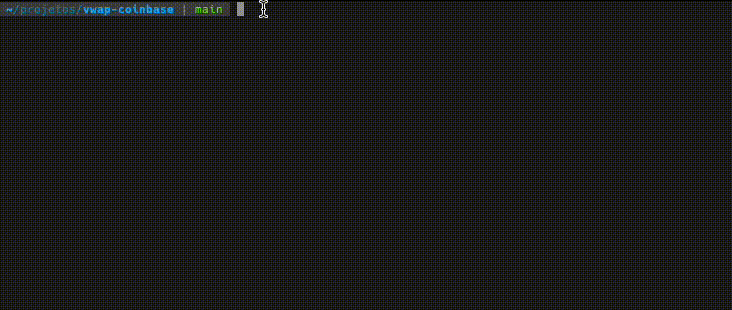

# vwap-coinbase



# What is this project

This is a simple project to calculate vwap by coin matches, consuming a websocket service provided by [coinbase](https://coinbase.com)

## How will set up the project

This project has twice ways to set up, local and with docker, for this we have a Makefile to help us.

To set up this project locally, we need install [golang](https://go.dev/) and run this code in your terminal
```shell
make local-build-run
```


To set up this project with docker, we need install [docker](https://www.docker.com/) and run this code in your terminal
```shell
make docker-build-run
```


## How run the tests
````shell
make test
````
